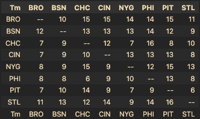

# Parsing Records: Head-to-Head Record Matrix Generator

## Overview

This Python script, `parsing_records.py`, is designed to generate a matrix of head-to-head win records for sports teams based on provided data. It leverages the pandas library for data manipulation and formatting, offering an efficient and readable way to visualize team performance against each other.

## Features

* **Data Parsing** : Converts JSON data into a structured matrix.
* **Matrix Generation** : Produces a head-to-head record matrix where each cell indicates the number of wins a team has against another.
* **Pandas Integration** : Uses pandas DataFrame for an efficient and user-friendly data structure.

## Requirements

* Python 3.x
* pandas library

## Installation

Before running the script, ensure you have Python installed. You can install pandas using pip if it's not already installed:

```
pip install pandas

```

## File Description

`parsing_records.py` - The main script file that contains the function to generate the head-to-head matrix and a sample data set to demonstrate its usage.

### Function: `create_head_to_head_matrix(records_data)`

This function takes a dictionary of records data and generates a pandas DataFrame representing the head-to-head win records matrix.

#### Parameters:

* `records_data` (dict): A dictionary with team names as keys. Each key's value is another dictionary indicating wins ('W') and losses ('L') against other teams.

#### Returns:

* `pandas.DataFrame`: A DataFrame representing the head-to-head win record matrix.

## Usage

1. Prepare a JSON-like dictionary with your team records.
2. Call the `create_head_to_head_matrix` function with this dictionary.
3. The function returns a pandas DataFrame which you can display or process further.

### Example

```
records_data = {
    # Your records data here
}

matrix_df = create_head_to_head_matrix(records_data)
print(matrix_df)
```

## Data Handling and Manipulation

* **Input Data Structure** : The script expects data in a nested dictionary format. This structure is chosen for its intuitive mapping of real-world relationships (team vs. team) and ease of access to specific records.
* **DataFrame Usage** : pandas DataFrame is utilized for its robust handling of tabular data. It simplifies complex operations like data transformation and alignment.
* **Iterative Processing** : The script iteratively populates the DataFrame. This approach, combined with pandas' optimized operations, balances readability and performance.
* **Formatting for Clarity** : The script formats the final matrix to enhance readability - aligning team names, setting a clear diagonal, and ensuring a symmetrical layout.

## Result

You should end up with a matrix as such:



## Contributing

Feel free to fork this repository and submit pull requests to enhance the functionalities or add new features.

## License

This project is open-sourced under the MIT License.
